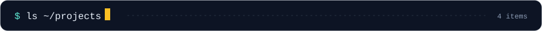
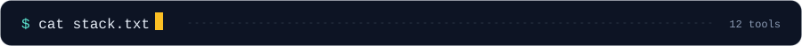
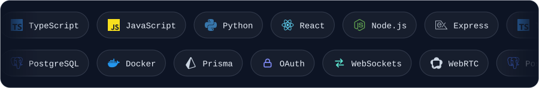

I build full products end to end: frontend, backend, auth, deploys.

 

  
  

  
  

 

<!--
  OPTIONAL contribution snake.
  1. The workflow is already in .github/workflows/snake.yml
  2. Push, then open the Actions tab, pick "Generate contribution snake", press "Run workflow"
  3. When it finishes, delete the opening and closing comment lines around this block.

 
<picture>
  <source media="(prefers-color-scheme: dark)" srcset="https://raw.githubusercontent.com/Aadarsh6/Aadarsh6/output/github-snake-dark.svg">
  
</picture>
-->

 

