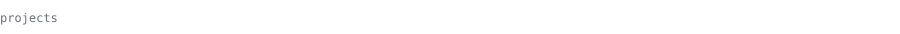
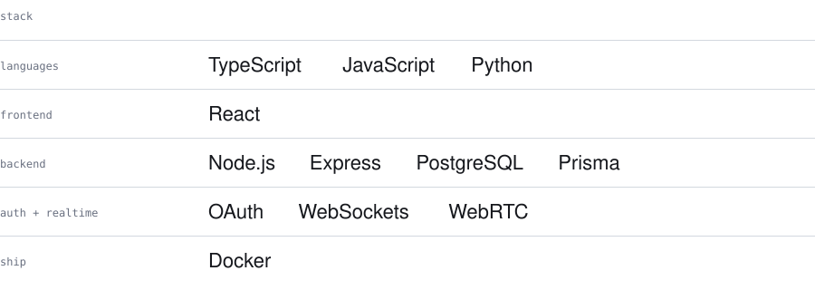
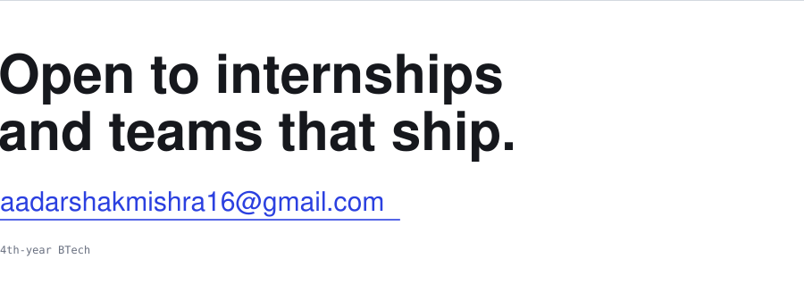

I build full products end to end: frontend, backend, auth, deploys.

 

  
  

  
  

 

<!--
  OPTIONAL contribution snake.
  1. The workflow is already in .github/workflows/snake.yml
  2. Push, then open the Actions tab, pick "Generate contribution snake", press "Run workflow"
  3. When it finishes, delete the opening and closing comment lines around this block.

 
<picture>
  <source media="(prefers-color-scheme: dark)" srcset="https://raw.githubusercontent.com/Aadarsh6/Aadarsh6/output/github-snake-dark.svg">
  
</picture>
-->

 

<picture>
  <source media="(prefers-color-scheme: dark)" srcset="assets/header-dark.svg">
  
</picture>

  <a href="https://aadarshm.me">aadarshm.me</a>&ensp;/&ensp;<a href="https://www.linkedin.com/in/aadarsh-mishra-883549418/">LinkedIn</a>&ensp;/&ensp;<a href="https://x.com/aadarshmX">X</a>&ensp;/&ensp;<a href="mailto:aadarshakmishra16@gmail.com">Email</a>

 

<picture>
  <source media="(prefers-color-scheme: dark)" srcset="assets/label-projects-dark.svg">
  
</picture>

<a href="https://github.com/Aadarsh6/Revenue-Recover-Razorpay-AI">
  <picture>
    <source media="(prefers-color-scheme: dark)" srcset="assets/project-revive-dark.svg">
    
  </picture>
</a>
<a href="https://github.com/Aadarsh6/Terminal-Talk">
  <picture>
    <source media="(prefers-color-scheme: dark)" srcset="assets/project-terminal-talk-dark.svg">
    
  </picture>
</a>
<a href="https://focuszen.aadarshm.me">
  <picture>
    <source media="(prefers-color-scheme: dark)" srcset="assets/project-focuszen-dark.svg">
    
  </picture>
</a>
<a href="https://xcraft.aadarshm.me">
  <picture>
    <source media="(prefers-color-scheme: dark)" srcset="assets/project-xcraft-dark.svg">
    
  </picture>
</a>

 

<picture>
  <source media="(prefers-color-scheme: dark)" srcset="assets/stack-dark.svg">
  
</picture>

<!--
  OPTIONAL contribution snake.
  1. The workflow is already in .github/workflows/snake.yml
  2. Push, open the Actions tab, pick "Generate contribution snake", press "Run workflow"
  3. When it finishes, delete the opening and closing comment lines around this block.

 
<picture>
  <source media="(prefers-color-scheme: dark)" srcset="https://raw.githubusercontent.com/Aadarsh6/Aadarsh6/output/github-snake-dark.svg">
  
</picture>
-->

<a href="mailto:aadarshakmishra16@gmail.com">
  <picture>
    <source media="(prefers-color-scheme: dark)" srcset="assets/contact-dark.svg">
    
  </picture>
</a>
